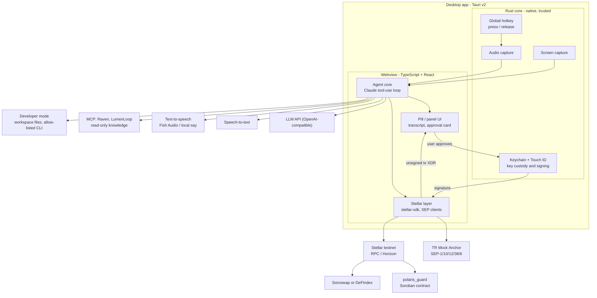
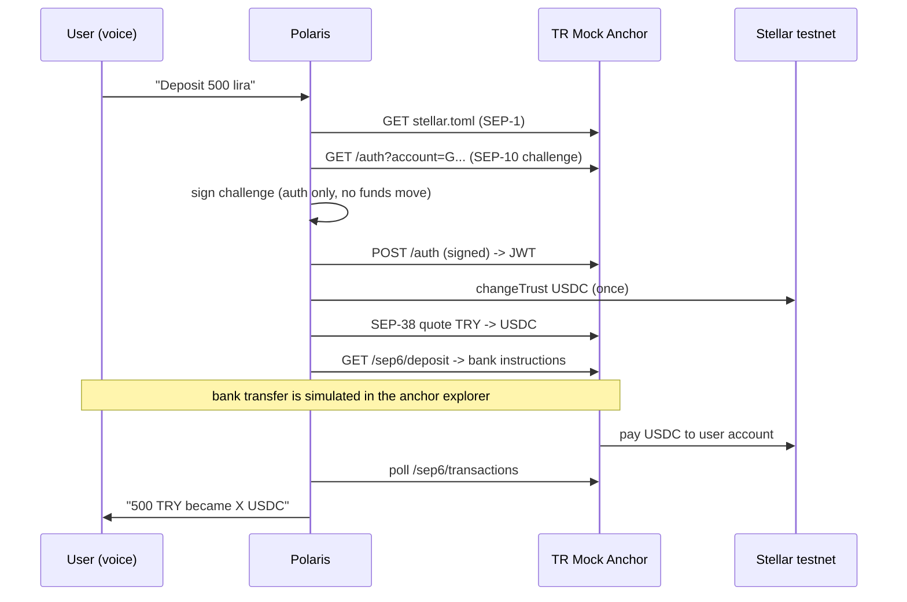

# Polaris — Architecture

> **Status:** living document. Working product name: **Polaris** (may change). Repo: `StellarVoiceControlProject`.
> Every claim tagged *verified* was checked on **2026-09-19** against the source named next to it.
> Status legend: ✅ decided · 🟡 proposed (needs team confirmation) · 🔲 open.
> *Last updated: 2026-09-19*

---

## 1. What we are building

A **push-to-talk voice assistant for Stellar developers and users**. The user holds a global hotkey and speaks; on release the assistant thinks, answers, and can act:

1. **Knows Stellar** — answers from official docs, skills, and live ecosystem data (via MCP servers).
2. **Moves money by voice** — e.g. "deposit 500 lira" runs a real TRY → USDC on-ramp through a Stellar anchor (SEP-6) or a P2P escrow ramp (§5.6), then an action on an eligible protocol.
3. **Sees the screen** — reads what is on screen (errors, forms) and can fill inputs / click buttons.
4. **Never moves value on its own** — every value-moving step needs explicit user approval with **Touch ID**.
5. **Builds software by voice (developer mode)** — the user can develop a Stellar project from inside the app: scaffold, edit, test and deploy (§4.6). This is a product requirement, not only a payments tool.
6. **Uses MPP for agent payments** — pay-per-request / pay-per-command with the Machine Payments Protocol, **not x402** (§5.5).

Track: **Genesis** (Stellar Pro Hackathon, 19–20 Sep 2026, submission deadline 20 Sep 12:00).

### Non-goals
- Mainnet, real money, or our own anchor implementation.
- Passkey smart wallet as a hard requirement (bonus only — see §5.4).
- x402. We use MPP instead (§5.5).
- A general-purpose desktop agent. Scope is Stellar workflows.

---

## 2. Hackathon requirements → design mapping

| Handbook requirement | How Polaris satisfies it | Status |
|---|---|---|
| **Anchor / local payments** (TRY in → usable balance; highest weight in *Ecosystem Fit*) | SEP-1/10/38/6 flow against the TR Mock Anchor, driven by voice | 🟡 |
| **Integration** with an eligible protocol, load-bearing | One of **Soroswap** (swap) or **DeFindex** (yield vault); picked by a testnet spike | 🔲 |
| **Own Soroban contract(s)** deployed on testnet, IDs documented | `polaris_guard` — on-chain spending policy + alias book + guarded payment | 🟡 |
| Real functionality, not mocked | Real testnet transactions; only the bank/KYC side is simulated by the anchor | 🟡 |
| Soroban auth & storage patterns | `require_auth` on owner; persistent storage for policy/aliases/daily counters | 🟡 |
| Cite Stellar Skills used (by path) | See §9 | 🟡 |
| README, architecture doc, demo, pitch deck | This file + README refresh + template deck | 🔲 |
| Bonus: passkeys / smart wallets | Optional Touch-ID passkey wallet; not required | 🔲 |
| **Agentic payments (MPP)** — workshop theme, `skills/agentic-payments/SKILL.md` | Pay-per-command via an MPP Session (§5.5). Counts as the handbook "Integration" only if organizers confirm; until then Soroswap/DeFindex stays the safe pick | 🔲 |
| **P2P ramp** (extra local-payment rail; product requirement) | Soroban escrow `polaris_p2p_escrow` (§5.6); anchor stays the primary path | 🔲 |
| **Developer mode** (product requirement) | Workspace-sandboxed dev tools + Stellar CLI (§4.6) | 🔲 |

---

## 3. System overview

**Design principle:** the *brain* (agent loop, MCP, Stellar SDK, UI) is TypeScript. The *Rust core* stays thin and only does what needs native access or must be trusted: hotkey, audio, screen capture, key custody, Touch ID, signing. The brain is shell-agnostic, so it can be developed and tested headless before the shell exists (see §10).

---

## 4. Components

### 4.1 Voice pipeline
| Stage | Choice | Status |
|---|---|---|
| Trigger | Tauri global-shortcut plugin. Handler receives `ShortcutState::Pressed` / `Released` → hold-to-talk. *Verified:* docs.rs `tauri_plugin_global_shortcut`. | ✅ |
| Capture | Microphone via webview `getUserMedia` or Rust (`cpal`); decided in the shell spike | 🔲 |
| STT (Turkish) | **Not decided.** Current plan: try **Whisper** first (local `whisper-rs`/whisper.cpp — offline, no key, safe on flaky venue Wi-Fi — or a cloud Whisper API). If it proves unstable, fall back to a **multimodal model that accepts audio directly**. Caveat: we have *not* verified that Claude models accept audio input — check before relying on it; otherwise another provider's API is needed. Decide by spike: Turkish accuracy + latency | 🔲 |
| TTS | **Fish Audio** `s2.1-pro-free` as primary (voice fixed by `POLARIS_TTS_REFERENCE_ID`), macOS `say -v Yelda` as the required local fallback; backend chosen by `POLARIS_TTS_BACKEND` | ✅ live 2026-09-19: pinned voice `9335…` (`Sarah`) verified end to end, MPEG payload + `afplay` (`backlog/2026-09-19-a3-tts.md`) |
| Read-back | Assistant speaks the parsed amount + recipient **before** any approval (guards against STT errors). A4 builds the sentence in TypeScript (`agent/src/speech.ts`) and hands the finished string to the Rust `speak` command; playback is non-blocking and utterances never overlap | ✅ (`backlog/2026-09-19-a4-speak-intent.md`) |

### 4.2 Agent core
- **LLM:** **OpenCode Zen Go**, OpenAI-compatible, model `glm-5.3-flash` (tool calling, no reasoning tokens). ✅ decided (2026-09-19, owner). It replaced `deepseek-v4.1-flash` in step A5 (same correctness on the real task; median 1857 ms vs 2085 ms). The endpoint is reached at `https://opencode.ai/zen/go/v1/chat/completions` with `Authorization: Bearer $OPENCODE_API_KEY`; it requires a per-conversation `x-opencode-session` header and a descriptive `User-Agent`. *Verified:* live curl on 2026-09-19 returns a correct `tool_calls` response for the Turkish command "Ahmete 5 USDC gönder".
  - **Provider is swappable by construction.** The client (`agent/src/llm/openai.ts`) implements the narrow `AgentLlm` port; base URL, model id and key come only from `POLARIS_AGENT_BASE_URL`, `POLARIS_AGENT_MODEL`, `OPENCODE_API_KEY`. Switching to Groq or OpenRouter (both OpenAI-compatible) is a `.env` change — no code change. A `ScriptedLlm`/`MockLlm` keeps the test suite off the network.
  - **Anthropic is a second implementation of the same port (A11).** `agent/src/llm/anthropic.ts` speaks the Messages API (`POST /v1/messages`, `x-api-key`, `anthropic-version: 2023-06-01`, top-level `system`, `input_schema` tools, required `max_tokens`). `POLARIS_AGENT_PROVIDER=anthropic` selects it and `POLARIS_AGENT_MODEL` chooses `claude-sonnet-5` / `claude-haiku-4-5`; the key is `ANTHROPIC_API_KEY`. Thinking is off for latency (Sonnet 5: `thinking:{type:"disabled"}` and no `budget_tokens`; Haiku 4.5: the field is omitted and `output_config.effort` is never sent). The Rust transport is provider-aware so the Anthropic key still never enters the webview bundle.
  - **Language is model-reported (A11).** The model returns the language of the turn (a `language` field on a tool call, or a leading `[xx]` tag on a text answer); the loop forwards it and the TTS layer selects a per-language voice, falling back to the pinned `POLARIS_TTS_REFERENCE_ID`. The reply itself is in the user's language because the system prompt requires it (`agent/src/prompt.ts`).
  - **The key never enters the webview.** The webview makes no provider HTTP request at all: it invokes the Rust `agent_chat` command (`app/src-tauri/src/agent.rs`), which reads `POLARIS_AGENT_BASE_URL` / `OPENCODE_API_KEY`, adds `Authorization` plus the session/User-Agent headers, and returns the provider's status and raw body. The TypeScript client keeps request construction, the error taxonomy and response parsing; only the transport moved. This also avoids the Tauri WKWebView's WebIDL receiver restriction on `Window.fetch`, and a packaged Polaris needs no dev server. ✅ (step A6; replaced the A2 Vite `/agent-api` proxy — see `backlog/2026-09-19-a6-webview-agent-transport.md`)
- **Loop:** system prompt (Stellar-specialised, safety rules) → tool-use loop → structured result to UI. Tools are grouped by risk tier (§6). Step A2 produces a validated `Intent` (e.g. `send_payment`) without executing it; the unsigned-XDR chain tools arrive in A5.
- **Spoken answer (A4):** a successful turn is spoken aloud through the Rust `speak` command. The sentence is built on the TypeScript side — a produced intent becomes a short confirmation (`Sending 5 USDC to Ahmet. Do you confirm?`, and its Turkish equivalent when the turn is Turkish, A11), a clarification is read as-is, and internal errors are never spoken. Playback is queued so utterances never overlap; `TTSError` never affects the visible result.
- **Knowledge tools (MCP, read-only):** all *verified* 2026-09-19.

| MCP | Transport / auth | Notes |
|---|---|---|
| **Raven** `https://raven.stellar.buzz/mcp` | remote HTTP, OAuth (PKCE) | 2 tools: `search`, `execute` (sandboxed JS, no network; calls `stellarDocs.*`, `lumenloop.*`, `scout.*`). Has an anchor-specific op `stellarDocs.search_anchor_sep_docs`. Community project, listed by Stellar docs. |
| **LumenLoop** `https://mcp.lumenloop.com` | remote HTTP, no auth | 18 read-only tools (projects, SCF submissions, content) |
| **Scout** `npx -y @stellar-light/scout-mcp` v1.2.1 | local stdio | 21 tools. Overlaps Raven's `scout.*`; **not needed at runtime** if Raven works. `submit_feedback` sends data out — never send project details. |

- Raven's OAuth inside the app needs a localhost/deep-link callback → real work; fallback is LumenLoop + direct docs search. 🔲

### 4.3 Stellar layer
- **Account:** one Ed25519 `G…` account for the user. Required because SEP-10 supports only `G`/`M` accounts (§5.4).
- **Fees:** the user's account pays XLM fees; a relayer is not needed for classic transactions. *Launchtube is retired* (domain no longer resolves; Stellar docs point to OpenZeppelin Channels, `https://channels.openzeppelin.com/testnet`) — only relevant if we adopt smart accounts.
- **Zero-XLM user problem 🔲:** a user who has just on-ramped TRY → USDC holds USDC but no XLM, yet a Stellar account needs XLM for its base reserve, each trustline reserve, and fees. On testnet Friendbot hides this; a real product would use **sponsored reserves** and **fee-bump transactions** (a sponsor account of ours pays), and OZ Channels for Soroban invocations. Decide whether the demo shows this; at minimum, document it as the production path.
- **Anchor client:** candidate `@stellar/typescript-wallet-sdk` (official) or direct HTTP. 🔲
- **Tx building:** `@stellar/stellar-sdk` in the webview; the **unsigned XDR** is handed to the approval card, then to the Rust core for signing.

### 4.4 Screen awareness & control
- **Read:** screenshot (Rust `xcap` or equivalent) → Claude vision. Works in any app (e.g. read a compile error in VS Code).
- **Act (browser):** drive a controlled browser through **CDP / Playwright** for deterministic fill/click (anchor demo pages, Stellar Lab).
- **Act (other apps):** read-only in MVP.
- **Rule:** the agent may fill forms but **never presses the final submit of a financial action**; that is the user's Touch ID step.
- Sequenced **after** the money path (§10).

### 4.5 Key custody & approval
1. Agent produces an **intent** (structured, not a signature).
2. UI renders the approval card **from the decoded XDR** — *not* from the LLM's description of it.
3. Assistant speaks back amount/recipient (A4: `spokenText(intent)` → `speak`).
4. User authenticates with **Touch ID**; the Rust core releases the key and signs.
5. Result is submitted; hash + explorer link shown.

Touch ID in Tauri: the *official* biometric plugin targets mobile only; the community plugin **`tauri-plugin-biometry`** covers macOS Touch ID with secure data storage (*verified* via its repo/crates listing; must be proven in the spike). The Ed25519 secret lives in the Keychain, never in the webview or the repo. Secure Enclave cannot hold Ed25519 (P-256 only), so the key is a Keychain item gated by biometrics.

### 4.6 Developer mode (build a project from inside the app) 🟡
Polaris is not only a payments assistant. The user must be able to **develop a project by voice/chat inside it**, e.g. *"create a Soroban contract called hello, run its tests, deploy it to testnet and show me the contract ID."*

- **Workspace sandbox:** the user picks a workspace folder; all file access is confined to it. Even inside it, a deny-list applies: `.env*`, `.stellar/`, `*.key`, `*.pem`, `*.seed`.
- **Tools:** read / create / edit files, search, and run **allow-listed commands** (`stellar`, `cargo`, `rustup`, `npm`/`pnpm`, read-only `git`; commits/pushes only on explicit request). Long commands use `caffeinate -i` (project rule). Output streams into the panel.
- **Knowledge:** the same Stellar MCPs and skills ground the coding turns (Raven playbooks, official skills).
- **Safety (same principle as §6):** reads are free; edits inside the workspace are shown as diffs; installs and deploys need confirmation; **anything signed with the user's key needs Touch ID**. Testnet only.
- **Implementation options** 🔲: (a) **Claude Agent SDK (TypeScript)** — ready-made file/shell tools, permission callbacks, MCP support, streaming; fastest path. It runs on Node, so inside Tauri it becomes a **Node sidecar** (added to the shell spike). (b) A hand-rolled tool loop with Rust-side fs/shell commands. Recommendation: (a) — verify the package name/version and its auth requirements (API key) before adopting.
- **Screen awareness helps here:** read compile errors from the IDE/terminal, then fix them.

---

## 5. Stellar design details

### 5.1 Anchor flow (TR Mock Anchor)
*Verified facts* (from `https://tr-mock-anchor.fly.dev/.well-known/stellar.toml`): `WEB_AUTH_ENDPOINT` (SEP-10) `/auth`, `TRANSFER_SERVER` (SEP-6) `/sep6`, `KYC_SERVER` (SEP-12) `/sep12`, `ANCHOR_QUOTE_SERVER` (SEP-38) `/sep38`; network passphrase `Test SDF Network ; September 2015`; asset `USDC`, issuer `GBBD47IF6LWK7P7MDEVSCWR7DPUWV3NY3DTQEVFL4NAT4AQH3ZLLFLA5` (Circle testnet), `anchor_asset="TRY"`. **No SEP-24, no SEP-45.** Organizer notes: KYC and bank are simulated; deposit cap 3000 TRY per transaction; home domain + `USDC` is all that is needed. Reference guide: `https://tr-mock-anchor.fly.dev/sep`.

Exact request parameters are **to be confirmed against the anchor's guide** during implementation.

### 5.2 Protocol integration (core feature)
Eligible candidates from the handbook: Soroswap, DeFindex (official integration skills exist for both), also Aquarius, Blend v2, Stellar Broker. Demo narrative: *TRY → USDC (anchor) → "put my USDC to work" (DeFindex vault) or "swap to XLM" (Soroswap).* Choose one after a **testnet availability spike** (quote/vault reachable, liquidity exists). 🔲

### 5.3 `polaris_guard` (our Soroban contract) 🟡
Purpose: make the safety rule **enforceable on-chain**, so even a compromised agent cannot exceed the user's policy.

| Function (sketch) | Auth | Effect |
|---|---|---|
| `set_policy(owner, per_tx_limit, daily_limit, allowed_assets)` | `owner.require_auth()` | store policy (persistent storage) |
| `set_alias(owner, alias, address)` | `owner.require_auth()` | voice address book ("Ahmet" → `G…`) |
| `pay(owner, to_or_alias, asset, amount)` | `owner.require_auth()` | check per-tx + rolling daily limit (day = ledger time / 86400), then SEP-41 `transfer` |
| `get_policy`, `get_alias`, `spent_today` | none | reads |

Open design questions: does the guard also proxy protocol calls (swap/vault) or only payments? How is the daily counter keyed/expired (TTL)? 🔲
Build/deploy uses the toolchain in §11; the WASM path is `target/wasm32v1-none/release/<name>.wasm`.

### 5.4 Why not a passkey smart wallet as the main account
Passkey smart wallets are `C…` contract accounts. SEP-10 (what the mock anchor offers) supports only `G`/`M`; contract accounts authenticate via **SEP-45**, which is **Draft** (v0.1.1) and not offered by this anchor (*verified:* SEP-45 text in `stellar/stellar-protocol`; anchor's `stellar.toml`). So the anchor identity must be a `G` account. A passkey wallet stays a **bonus** for extra Soroban-auth credit.

### 5.5 Agentic payments with MPP (instead of x402) 🟡
We use **MPP (Machine Payments Protocol)**, not x402. Both give the HTTP `402 Payment Required` status a machine-readable meaning. Practical difference (per `skills/agentic-payments/SKILL.md`): x402 needs a **facilitator** (hosted or self-hosted) that also sponsors fees; MPP settles with native Soroban **SAC token transfers** and needs **no third-party facilitator**. *Verified:* `https://developers.stellar.org/docs/build/agentic-payments/mpp` and the skill file.

| Mode | How it works | Use when |
|---|---|---|
| **Charge** | Client calls API → server replies `402` with payment terms → client returns a credential → each request settles on-chain. *Pull* (default): client signs Soroban auth entries and the **server broadcasts** (it can sponsor fees). *Push*: client broadcasts and sends tx hash + proof; client pays fees | occasional / per-request payments |
| **Session** | One-way payment channel (Soroban contract `one-way-channel`): the funder **deposits once**; every request carries a **cumulative commitment signed off-chain**; the server **closes the channel later** with a single settlement transaction | high-frequency agent traffic |

Packages: `@stellar/mpp`, `mppx`, `@stellar/stellar-sdk` (docs demo: 0.01 USDC per request).
Gotchas: USDC **trustline on both payer and recipient**, otherwise the SAC transfer fails with `op_no_trust`; the classic issuer (`G…`) is for trustlines while the **SAC address (`C…`)** is what transfers call; Circle's testnet faucet needs a manual captcha.

**Proposed role in Polaris (to be confirmed):**
- **(A) Pay-per-command AI.** A small backend of ours holds the model/STT keys and charges each voice command through an MPP **Session**: the user funds USDC (TRY → USDC via the anchor), opens a channel once, every command is a signed off-chain increment, and the channel is settled at the end. This links anchor → MPP → product usage in one story and matches Session mode's sweet spot.
- **(B) Developer-mode template.** Polaris can scaffold an MPP-protected API (`@stellar/mpp` server) for the user's own project (§4.6).

Open: MPP is not on the handbook's curated integration list (the list is *not* exclusive — any protocol from the full SCF Integration List qualifies) → **ask the organizers** whether it counts as the required "Integration". Prior art on Scout: *NextForge* (Stellar Hacks: Agents) combines MPP with Soroban escrow; *TollPay* (5th place, Agents) sells per-call USDC micropayments for MCP servers.

### 5.6 P2P ramp (added to the anchor structure) 🟡
Besides the anchor (institutional rail), users can **trade TRY ↔ USDC peer-to-peer**. A seller locks USDC in a **Soroban escrow contract**; the buyer sends TRY off-chain (e.g. bank transfer); the seller confirms receipt and the contract releases the USDC to the buyer; timeout/dispute paths refund. Voice examples: "sell 100 USDC for lira", "buy USDC from the best open offer".

Contract sketch — `polaris_p2p_escrow`: `create_offer(seller, asset, amount, price_try, ttl)` · `accept(buyer, offer_id)` · `confirm_fiat(seller, offer_id)` → release · `cancel` / `expire` → refund · `dispute` (MVP: a fixed arbiter address). It would be a second own contract with real Soroban auth and storage.

**Prior art (Scout, verified 2026-09-19):** *Pacto* — decentralized P2P exchange, flagged as a winner at the Stellar LATAM Hackathon; also *MicoPay* (PULSO), *AnyRamp* (Real-World ZK: P2P fiat-to-crypto proven with ZK), *Mammon* and *PeerPesa* (Build Better). A plain P2P ramp is therefore **not novel**: our differentiator must be the voice/developer-tool experience and MPP, not the ramp itself.

**Scope caution:** medium-size contract + UI. Build it **after** the anchor path works; if time runs short, cut it before the anchor, the guard, or approval. Decide which own contract(s) we ship: `polaris_guard` (small), `polaris_p2p_escrow` (medium), or both. The anchor remains the primary, workshop-endorsed local-payment path.

---

## 6. Security model

**Principle:** the LLM proposes; the user disposes. Everything the model reads from outside is **data, not instructions**.

| Tier | Examples | Gate |
|---|---|---|
| 0 — read-only | doc search, balances, screenshots | none |
| 1 — UI actions | fill inputs, click non-financial buttons | logged; confirm per session |
| 2 — low-risk signatures | SEP-10 challenge, trustline | in-app confirm |
| 3 — value-moving | payment, swap, vault deposit | **read-back + Touch ID** |

Threats and mitigations:
- **Prompt injection** via screen text / web pages / MCP results → treated as untrusted data; Tier 3 cannot be reached without human approval; on-chain limits still apply.
- **STT mis-hearing** → read-back of amount + recipient; approval card built from XDR.
- **Key exposure** → Keychain + biometrics; key never in webview/logs/repo; testnet only.
- **Runaway agent** → per-tx and daily limits enforced by `polaris_guard`; client-side limits too.
- **Secrets in git** → `.env`, key files, and the Stellar CLI's project-local `.stellar/` (holds secret keys) are git-ignored via the root `.gitignore`. Keep API keys in a local `.env`; commit only a `.env.example` without values.

---

## 7. Technology decisions

| Area | Decision | Status |
|---|---|---|
| Shell | **Tauri v2** with a *thin Rust core* + TypeScript/React webview. Rationale: native press/release hotkey, key custody and signing outside the webview, Touch ID plugin exists, small footprint. **Not** because "Stellar uses Rust" — contracts are a separate project and app-side Stellar SDKs are JS-first. | ✅ (spike-gated) |
| Fallback | If the spike fails (hotkey, mic, Touch ID, or macOS permissions in dev builds), switch to **Electron**: the TS brain is reused unchanged. | ✅ |
| UI | React + TypeScript (Vite) | 🟡 |
| LLM | OpenCode Zen Go (`glm-5.3-flash`) or Anthropic (`claude-sonnet-5` / `claude-haiku-4-5`) behind the same `AgentLlm` port; selected by `POLARIS_AGENT_PROVIDER` | ✅ |
| STT / TTS | see §4.1 | 🔲 / ✅ (live Fish + A4 spoken read-back) |
| Contracts | Rust + `soroban-sdk`, deployed with Stellar CLI | ✅ |
| Network | Stellar **testnet** only | ✅ |

**Shell spike gate (≈2 h, macOS):** in a Tauri dev build prove (1) hotkey press/release, (2) microphone capture, (3) Touch ID prompt + Keychain read via `tauri-plugin-biometry`, (4) a screenshot. Known risk to watch: an unbundled dev binary may attribute macOS privacy permissions (mic / screen / accessibility) to the parent terminal or IDE.

---

## 8. Build order

Agreed order: **assistant first → anchor → screen control.** The money path and the contract are handbook requirements, so they are scheduled, not optional.

| # | Milestone | Acceptance |
|---|---|---|
| **A** | **Brain, headless.** Text in → Claude → MCP tools → answer, run from a terminal | 10 Stellar questions (SEP-6/10, Soroban auth, testnet setup) answered correctly with tool calls succeeding; failures logged |
| **A2** | **Developer mode.** Chat/voice: scaffold a Soroban project in a workspace, edit, test, deploy to testnet | contract created, built, deployed, ID printed; nothing touched outside the workspace |
| **B** | **Voice shell.** Tauri app: hold hotkey, speak Turkish, get spoken + written answer | end-to-end works; latency measured; shell spike gate passed |
| **C** | **Anchor path.** Voice → SEP-10/38/6 → USDC balance on testnet | balance visible on Stellar explorer after simulated deposit |
| **C2** | **MPP.** Pay-per-command through an MPP Session (Charge as fallback), funded with anchor USDC | one session on testnet: deposit → N commands → settlement |
| **C3** | **P2P ramp** *(optional)*. `polaris_p2p_escrow` + voice offers | create / accept / release / expire work on testnet |
| **D** | **Approval + guard.** Touch-ID approval card; `polaris_guard` deployed; protocol action | contract ID documented; over-limit payment rejected on-chain |
| **E** | **Screen awareness.** Read errors; browser fill/click; final submit gated | demo scene works without touching the mouse |
| **F** | **Submission.** README, this doc, contract IDs, deck, skill paths, demo | handbook checklist complete |

---

## 9. Stellar Skills used (to confirm at submission)
Handbook requires citing skill files by path. Candidates, from `https://skills.stellar.org/`:
`skills/standards/SKILL.md` (SEPs/CAPs) · `skills/smart-contracts/SKILL.md` · `skills/dapp/SKILL.md` · `skills/assets/SKILL.md` · `skills/data/SKILL.md` · DeFindex SDK / Soroswap SDK skills (whichever protocol is chosen). `skills/agentic-payments/SKILL.md` (MPP — planned, §5.5). Update this list as skills are really used.

---

## 10. Risks & open items

| Risk / question | Plan |
|---|---|
| Touch ID / hotkey / mic behave badly in Tauri dev builds | Shell spike gate (§7); Electron fallback |
| Raven OAuth inside the app | Fallback to LumenLoop + direct docs; keep Raven for dev-time use |
| STT quality for Turkish | Compare local whisper.cpp vs cloud in a quick spike |
| Chosen protocol has no testnet liquidity / vault | Availability spike first; keep both Soroswap and DeFindex as candidates |
| Anchor API details differ from assumptions | Follow `https://tr-mock-anchor.fly.dev/sep`; anchor changes are announced in the organizers' group |
| Scope growth: anchor + MPP + P2P + developer mode + screen control + Touch ID + guard | Must-haves: brain, developer mode, anchor path, approval + one own contract. Cut in this order: P2P → screen *acting* → MPP extras. Never cut anchor, approval, or the contract |
| Time (~32 h to deadline) | Follow §8 order; re-check the cut line at each milestone |
| Handbook claims of a "Launchtube" requirement | Not in the handbook; service is retired. Ask organizers if in doubt |
| No LICENSE in repo | Choose a license before submission (public repo is required) |

Open decisions: STT provider · protocol (Soroswap vs DeFindex vs MPP-as-integration) · MPP role (pay-per-command vs template) · which own contract(s): guard / P2P escrow / both · developer-mode implementation (Agent SDK sidecar vs custom tool loop) · guard scope (payments only vs also protocol calls) · whether SEP-10 signing needs Touch ID · coordinator-model rules from `CLAUDE.md` (to be discussed before coding starts). LLM provider is decided: OpenCode Zen Go, behind a swappable OpenAI-compatible port (§4.2).

---

## 11. Toolchain (this dev machine, verified 2026-09-19)
Rust 1.98.1 (rustup) · targets `wasm32v1-none`, `wasm32-unknown-unknown` · Stellar CLI 28.0.0 · `soroban-sdk` 27.0.6 (via `stellar contract init`) · Node 24.16.0 (nvm) · VS Code + rust-analyzer + CodeLLDB · Claude Code CLI 2.1.277 · GitHub CLI 2.101.0.
Smoke test passed: identity → fund → `stellar contract build` → deploy to testnet → invoke.
> Doc gotcha: some Stellar docs still show `target/wasm32-unknown-unknown/release/...`; the real output of `stellar contract build` is under `target/wasm32v1-none/release/`.

---

## 12. Organizer resources — what is useful for Polaris
Source: the organizers' "Developer Resources" list, reviewed 2026-09-19 (pages marked *verified* were opened).

| Resource | Use in Polaris | Priority |
|---|---|---|
| **Frontend Bindings** — `stellar contract bindings typescript --network testnet --contract-id <alias> --output-dir packages/<name>` (*verified*) | Typed TS client for our own contracts (`polaris_guard`, escrow): the seam between whoever owns the contracts and the app. Also a great developer-mode demo ("generate the bindings"). Docs example uses RPC `https://soroban-testnet.stellar.org:443`; signing is not covered on that page | High |
| **OpenZeppelin Relayer / Channels** — `https://channels.openzeppelin.com/testnet` (*verified*) | Fee sponsorship for Soroban calls and smart accounts. The organizers' own list says it **replaces Launchtube, which SDF discontinued** — this settles the group-chat claim about Launchtube | High |
| **Example Contracts** (*verified*) | Templates: **Single Offer Sale**, **Timelock**, **Atomic Swap** → P2P escrow. **Auth**, **Complex Account** (custom auth policies), **Payment limits** (delegated minting with limits) → `polaris_guard`. Also Token (SEP-41), Cross-contract calls, **Workspace** (multi-contract repo), Fuzz testing | High |
| **Smart Contract Authorization** doc | Correct `require_auth` / auth-entry semantics for guard and escrow | High |
| **Stellar Lab**, **Stellar.Expert** | Verify transactions, build/inspect XDR by hand, explorer links on the approval card; the ideal **browser scene** for the screen-awareness demo | High |
| **Circle USDC/EURC faucet** | Test USDC for the MPP payer and other flows (manual captcha) | Medium |
| **Build Applications overview** (*verified*) | Wallet SDK (TypeScript), JS SDK, and SEP-10/12/38 (plus SEP-24/31) guides → anchor client. No payment/trustline/fee-bump tutorial there | Medium |
| **Stellar Design System** | React components for a polished panel and approval UI (UX criterion) | Medium |
| **Passkey-Kit**, Smart Wallet docs, Guestbook, demo chat apps | Bonus passkey wallet. **The list's `kalepail/passkey-kit` link is archived** (read-only since 2026-07-31); development moved to **`stellar/passkey-kit`**, which uses OZ Channels for fees (*verified*) | Low (bonus) |
| Scaffold Stellar / SvelteKit templates | We use Tauri + React, so not needed; skim for ideas | Low |
| Soroban Quest, Ecosystem Resources | Learning material for teammates | Low |
| a16z "How stablecoins will eat payments" | Pitch narrative (impact criterion) | Low |
| Stellar RPC, Horizon, SDK library, Developer Tools | Reference | Ref |

---

## 13. Team workflow (two people, parallel agents) 🟡
Two people, each on their own machine, each running **their own coordinator agent with many subagents**. Work proceeds **section by section, split by layer/directory**. The seams between layers are typed interfaces agreed first, so both sides can build in parallel and integrate early. (The wide scope is deliberate: an AI automation runs behind it.)

Proposed layers (who takes which is the team's call):

| Layer | Scope | Suggested directories |
|---|---|---|
| **Brain & shell** | Tauri shell, voice pipeline, agent core, MCP, developer mode, screen control, approval UI | `app/`, `agent/` |
| **Chain** | Anchor client (SEP-10/38/6), MPP, protocol integration, Soroban contracts (`polaris_guard`, escrow), typed bindings, signing-service interface | `stellar/`, `contracts/` |

Interfaces to define **first** (`docs/interfaces.md`, as TypeScript types):
1. `Intent` — a structured value-moving request (kind, asset, amount, recipient, memo, source).
2. Chain tools exposed to the agent — each returns an **unsigned XDR plus a human-readable summary decoded from that XDR**.
3. Signing service — `sign(payloadHash)`, callable only after Touch ID approval.
4. Status/event stream for the UI.

Rules:
- One task per git worktree/branch, merged by PR (see `CLAUDE.md`); ownership by directory to avoid conflicts.
- Build a **vertical slice early** (voice → agent → one real testnet transaction) instead of integrating at the end.
- Each person uses **their own** testnet identity; never share or commit keys.
- The mock anchor's treasury is **shared** (3000 TRY cap per deposit) and has already been drained once: be gentle.
